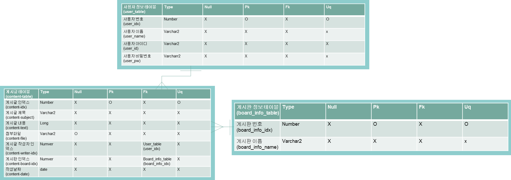
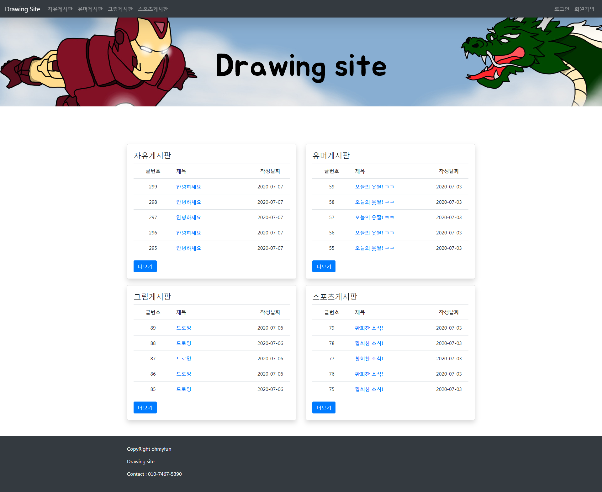
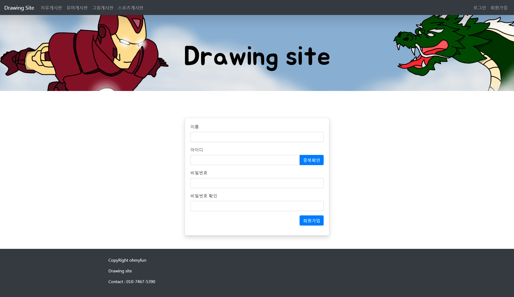
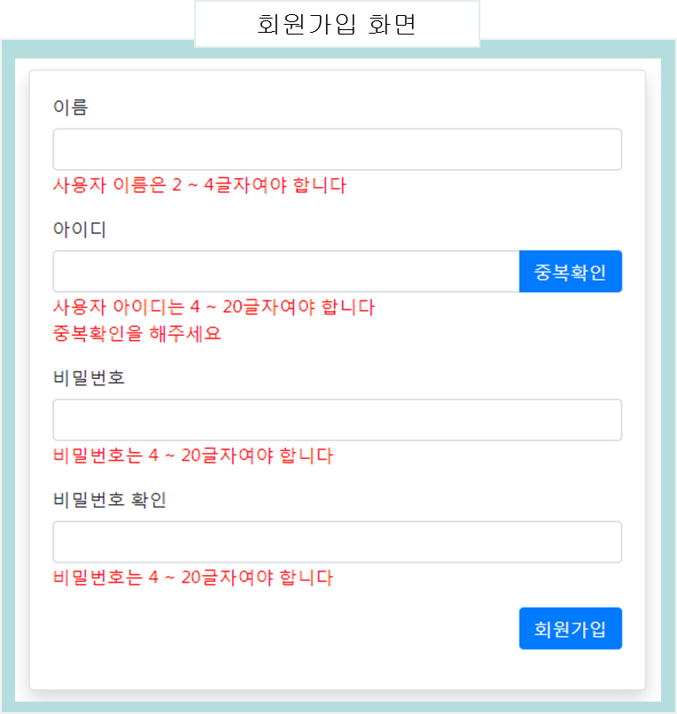
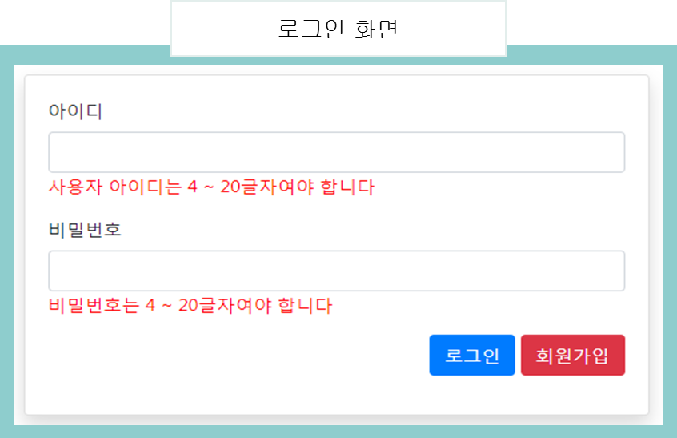
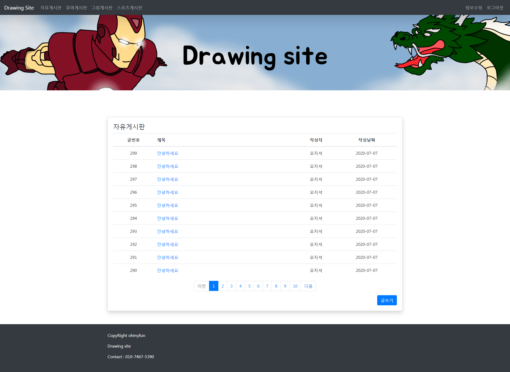
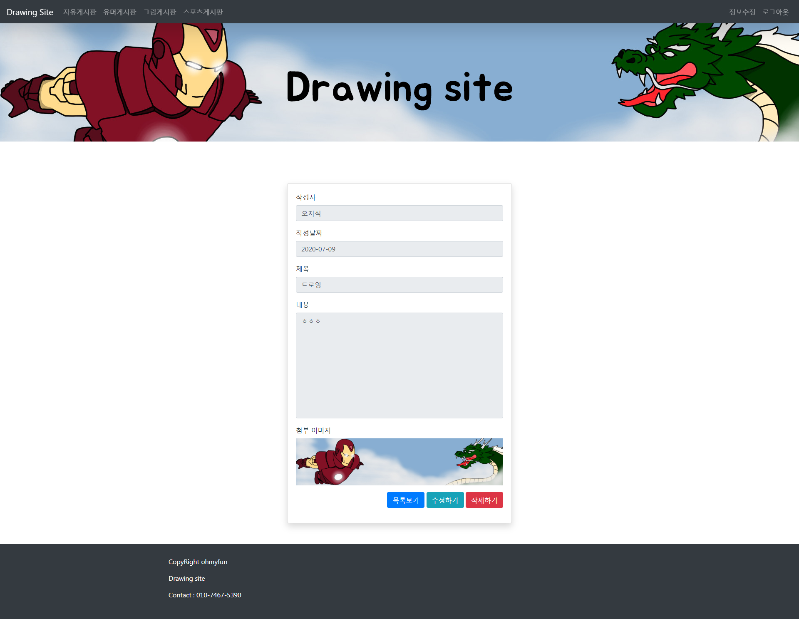
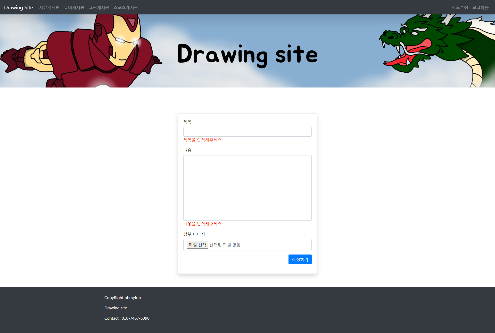
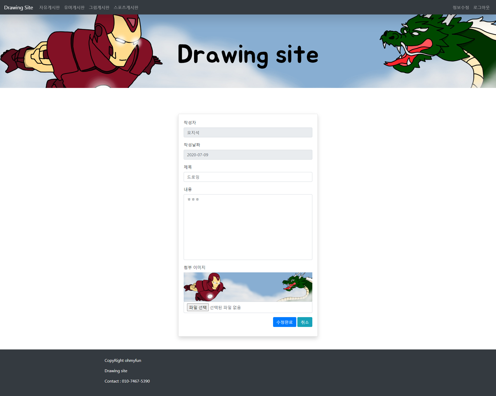

# 프로젝트 설명

본 프로젝트는 게시물을 올리고 내리며 게시글을 다양한 사용자들이 공유할 수 있는 게시판입니다.

### 개발 인원

1명

### 담당 업무

오라클 DBMS 연동을 통한 로그인, 회원가입, CRUD 처리, 페이징 처리

### 프로젝트 목표

사용자들이 실시간으로 다양한 정보를 공유할 수 있는 게시판 홈페이지 제작

### 구현 기능

     - 회원가입
     - 로그인
     - CRUD
     - 페이징 
     

### 개발 도구

     - Jdk : 8 버전
     - Spring framework : spring 5
     - 웹서버 : Apache
     - WAS : Tomcat 9.0
     - Maven : 3.2.1
 

# 데이터베이스 테이블 설계

 

# 화면 구성

## 메인 화면

 

## 회원가입 및 로그인 화면
### 회원가입 

 

### 회원가입 유효성 검사

### 로그인 

 

### 로그인 유효성 검사

## 게시판 화면
### 자유 및 유머 게시판

 

### 그림 및 스포츠 게시판

 

### 게시글 화면

 

### 게시글 작성

 

### 게시글 수정 

